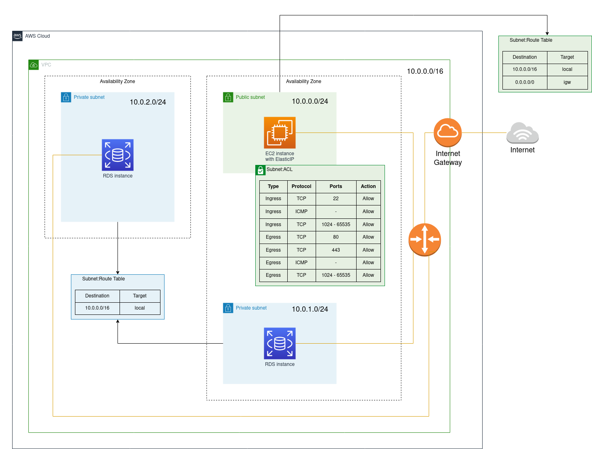

# SI Terraform AWS VPC

University project (Społeczeństwo Informacyjne) - an example of provisioning an infrastructure at AWS with Terraform. 

The infrastructure consists of:

- the VPC with 3 subnets: public (which is able to communicate with the Internet), 2 private (can only communicate within the VPC),
- the EC2 instance (with installed PostgreSQL terminal client),
- the RDS instances (only connections from the VPC are allowed, e.g. from the EC2 instance).



## Running up

Copy and edit vars (database's password, public key for SSH connection with the instance):

```bash
cp vars.tfvars{.example,}
vim vars.tfvars
```

Prepare Terraform and then create the infrastructure:

```bash
terraform init 
terraform apply -var-file="vars.tfvars"
```
